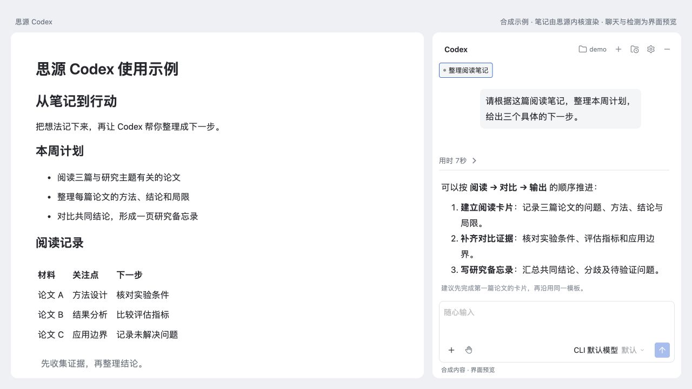
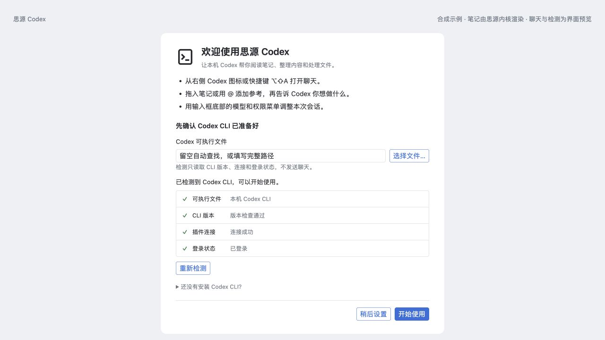

# 思源 Codex

[English](README.md) · **简体中文**

[](https://github.com/fu1fan/siyuan-codex/releases/latest)
[](LICENSE)
[](https://b3log.org/siyuan/)

在思源笔记里，继续使用你的 Codex。通过右侧聊天栏调用本机 Codex CLI，把笔记、附件和工作目录接入同一段对话。



*界面预览使用插件自身组件；笔记由隔离思源内核渲染，对话为合成演示内容。*

## 功能

- **笔记上下文**：拖入文档或内容块，用 `@`、加号菜单或 `[[` 引用笔记。通过当前工作区 MCP 按需读取、检索和修改笔记。
- **图片与文件**：粘贴或拖入图片、PDF 和其他文件，输入框上方显示附件卡片；PDF 优先读取原文件，并按任务查看相关页。
- **持续对话**：保存会话、草稿和附件；多会话可同时工作，状态圆点提示运行、完成、错误或等待审批。
- **本机 Codex 历史**：继续已有 CLI、桌面版和 app-server 会话，也可把其他对话作为参考。外部会话发送成功后加入插件历史。
- **模型与权限**：直接选择 CLI 提供的模型、推理强度及快速模式，处理命令、文件修改与 MCP 调用审批。
- **项目与目录**：新对话使用独立的无项目目录，也可选择本机项目，或为文档及子文档绑定工作目录。
- **富文本输出**：支持 Markdown、表格、代码复制、LaTeX 和 Mermaid；工作过程可展开查看，最终回答保持可见。
- **首次使用引导**：欢迎页检查 CLI 路径、版本、插件连接和登录状态，已配置用户升级时不自动弹出。

## 安装

需要 **思源 3.8.6 或更新版本的桌面端**，以及安装在同一操作系统中的 **Codex CLI**。支持 macOS、Windows 和 Linux；浏览器、移动端及 Docker 前端暂不支持。Windows 使用本机 CLI。分平台说明与验证范围见 [COMPATIBILITY.md](COMPATIBILITY.md)。

### 1. 准备 Codex CLI

按 [Codex CLI 官方说明](https://github.com/openai/codex#quickstart)安装，并在终端运行 `codex login` 完成登录。插件复用你的 CLI 登录与模型配置；使用模型需要相应账号或提供方权限。

### 2. 安装插件

**插件商店**：上架后，在「设置 → 集市 → 插件」搜索「思源 Codex」并安装、启用。

**手动安装**：从 [最新 Release](https://github.com/fu1fan/siyuan-codex/releases/latest) 下载 `package.zip`，解压到目标思源工作区的 `data/plugins/siyuan-codex/`，再在集市的已下载插件中启用。`plugin.json` 和 `index.js` 必须直接位于该目录，不能再套一层 `package/`。

### 3. 检测与开始使用

首次启用会打开欢迎页，自动检测本机 CLI。路径留空即可自动查找；查找失败时，填写 `codex` 可执行文件的完整路径后重新检测。设置中也可以随时打开欢迎页或检测 CLI。



*欢迎页界面预览，检测结果为模拟数据；未发送模型推理请求。*

从右侧 Codex 图标打开聊天，拖入一篇笔记，输入「总结这篇笔记，列出三个可执行的下一步」，即可开始。

## 常用操作

| 操作 | 方法 |
| --- | --- |
| 打开聊天 | 右侧 Codex 图标，或 `Alt+Shift+A`（macOS：`⌥⇧A`） |
| 发送 / 换行 | `Enter` / `Shift+Enter` |
| 引用笔记 | 拖入文档或内容块，输入 `@`、`[[`，或点击输入框的 `+` |
| 添加图片、文件 | 粘贴或拖入；单个附件最多 20 MB，每轮最多 20 项参考资料 |
| 功能菜单 | 输入框首字符输入 `/`；支持中文、拼音和首字母筛选 |
| 模型、推理与快速模式 | 输入框底部的模型菜单，或 `/` 功能菜单 |
| 调整权限 | 输入框底部的权限按钮；按具体请求允许或拒绝 |
| 工作目录与文档绑定 | 聊天顶栏的文件夹按钮 |
| 查找历史对话 | 顶栏历史按钮，切换「插件历史」或「全部 Codex」 |

默认会话使用 Codex 的无项目任务文件夹（默认 `~/Documents/Codex`），每个聊天分配独立目录。需要处理项目时，在首次发送前选择工作目录；已开始的会话保留原目录。文档绑定供后续新会话使用。

## 数据与权限

- 插件调用本机 `codex app-server`，继承 CLI 的账号、模型提供方、配置、`AGENTS.md`、技能及已有 MCP；不改写 `~/.codex/config.toml`。
- 自动连接**当前思源工作区**的同源 `/mcp`，复用运行时 Token 与本机工作区 CA。Token 不写入插件设置、聊天记录或命令行参数。
- **文件权限与笔记写入权限分别控制**：Codex 文件沙箱约束本机文件和命令；MCP 工具的写入能力由思源内核设置决定。希望只读笔记时，请在思源 MCP 设置中关闭写工具。
- 消息、附加参考资料及 Agent 读取的内容可能发送到 CLI 配置的模型服务。引用笔记时先提供 ID、标题及有限附件元数据，需要正文时再读取。
- 设置、文档目录绑定、聊天记录和附件副本保存在当前工作区，可能随思源同步。本机工作目录和 Codex 历史由 Codex 管理，跨设备路径需要重新确认。
- 删除插件中的聊天不会删除工作目录，也不会删除或归档 Codex 保存的线程。

## 常见问题

**检测不到 CLI？** 在 macOS/Linux 终端运行 `command -v codex`，Windows PowerShell 运行 `(Get-Command codex).Source`，把输出的完整路径填入设置。Windows 支持 `codex.exe`、`codex.cmd` 和 `codex.ps1`。检测通过但未登录时，先回终端完成登录。

**无法访问笔记？** 确认当前思源内核 MCP 已启用，并检查对应能力是否暴露。聊天能连接 CLI，不代表笔记工具已经连接成功。

**桌面版历史在哪里？** 历史面板选择「全部 Codex」，按标题检索同一设备、同一 `CODEX_HOME` 的会话。打开外部会话时先预览；从插件成功发送后才永久加入插件历史。其他设备及云端历史暂未接入。

**支持 API Key 或其他模型提供方吗？** 插件沿用 Codex CLI 的提供方配置，不单独维护一套 API Key 设置。可选模型和快速模式是否可用取决于 CLI 与提供方。

**当前有哪些限制？** 界面目前以简体中文为主；尚不支持移动端、浏览器、技能斜杠菜单或复杂 MCP OAuth 表单。图片输入支持 PNG/JPEG/WebP/GIF，其他格式作为文件处理。分平台启动逻辑和 CI 检查不能代替每个平台的原生桌面验收。

## 开发与发布

需要 Node.js 22 或更新版本。

```sh
git clone https://github.com/fu1fan/siyuan-codex.git
cd siyuan-codex
npm ci
npm run check
npm test
npm run build
npm run verify:package
```

产物为 `dist/`、`package.zip` 和带版本号的 ZIP。GitHub Actions 在 macOS、Linux、Windows 上检查 Node.js 22/24；推送与 `plugin.json` 版本一致的 `v*` 标签可构建并发布 Release。

本地调试和演示使用隔离工作区，避免影响日常笔记。自动提示词见 [PROMPTS.md](PROMPTS.md)，多会话设计见 [MULTI-SESSION.md](MULTI-SESSION.md)，目录行为见 [WORKSPACES.md](WORKSPACES.md)。发布流程见 [发布指南](docs/RELEASING.md)。

反馈问题时，请附思源、插件和 CLI 版本、操作系统、复现步骤及脱敏日志：[提交 Issue](https://github.com/fu1fan/siyuan-codex/issues)。

## 致谢与协议

感谢 [思源笔记](https://github.com/siyuan-note/siyuan)提供插件 API、Protyle 编辑器和本机渲染能力，[Codex CLI](https://github.com/openai/codex)提供 Agent 运行时，以及 [Claudian](https://github.com/YishenTu/claudian)的本机 Agent 工作流启发。文档组织参考了 [Document Flow](https://github.com/frostime/sy-docs-flow) 和 [Query & View](https://github.com/frostime/sy-query-view)。

本项目采用 [MIT 协议](LICENSE)。第三方依赖保留各自协议，见 [NOTICE](NOTICE)。这是独立社区插件，与 OpenAI、思源官方没有隶属关系。
